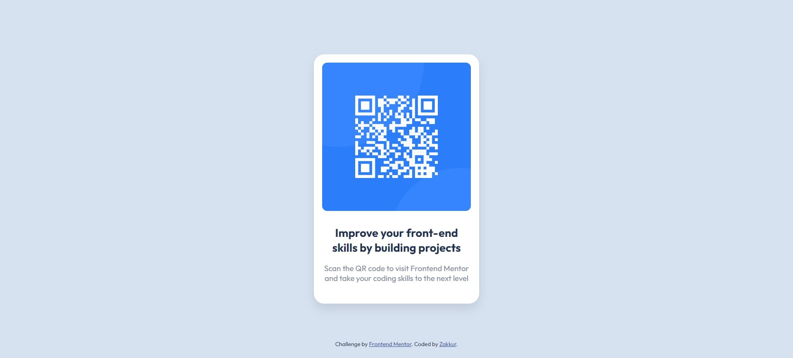

# Frontend Mentor - QR Code Component Solution

This is my solution to the [QR Code Component challenge on Frontend Mentor](https://www.frontendmentor.io/challenges/qr-code-component-iux_sIO_H). Frontend Mentor challenges help you improve your coding skills by building realistic projects.

## Table of Contents

- [Overview](#overview)
  - [The Challenge](#the-challenge)
  - [Screenshot](#screenshot)
  - [Links](#links)
- [My Process](#my-process)
  - [Built With](#built-with)
  - [What I Learned](#what-i-learned)
  - [Useful Resources](#useful-resources)
- [Author](#author)

## Overview

### The Challenge

The challenge was to build a responsive QR code component that matches the provided designs for mobile (375px) and desktop (1440px) layouts. The component includes a QR code image, a heading, and a paragraph, styled to closely resemble the design files. The page should be accessible and use semantic HTML where appropriate.

### Screenshot



### Links

- **Live Site URL**: [https://zakkur17.github.io/qr-code-component-main/]
- **Solution URL**: [https://github.com/Zakkur17/qr-code-component-main.git]

## My Process

### Built With

- Semantic HTML5 markup (e.g., `<main>`, `<section>`, `<article>`)
- CSS custom properties (minimal in this project)
- Flexbox for centering and layout
- Media queries for responsive design
- Google Fonts: Outfit (weights 400 and 700)

### What I Learned

This project helped me solidify several key skills:

- **Responsive Design**: Using media queries to adjust the layout for mobile (375px) and desktop (1440px) viewports.
- **Accessibility**: Adding a descriptive `alt` text for the QR code image and using semantic HTML to improve structure. For example:
  ```html
  <main>
    <section class="qr-container">
      <article class="qr-card">
        
        <h1>Improve your front-end skills by building projects</h1>
        <p>Scan the QR code to visit Frontend Mentor and take your coding skills to the next level</p>
      </article>
    </section>
  </main>
  ```
- **Flexbox**: Mastering Flexbox to perfectly center the QR code card on the page.

### Useful Resources

- [MDN Web Docs](https://developer.mozilla.org/en-US/) - Great reference for HTML semantics and CSS properties.
- [CSS Tricks - Flexbox Guide](https://css-tricks.com/snippets/css/a-guide-to-flexbox/) - Helped me master Flexbox for centering the component.
- [Google Fonts](https://fonts.google.com/) - Used to import the 'Outfit' font.

## Author

- Name: Zakkur Lie-A-Ling
- Frontend Mentor: [@Zakkur17](https://www.frontendmentor.io/profile/Zakkur17)
- GitHub: [@Zakkur17](https://github.com/Zakkur17)
```


